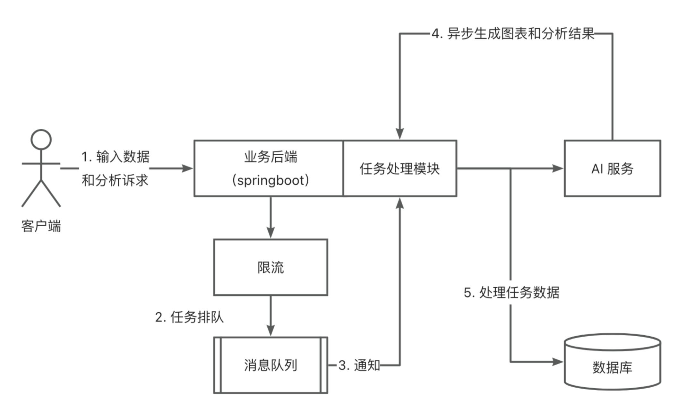
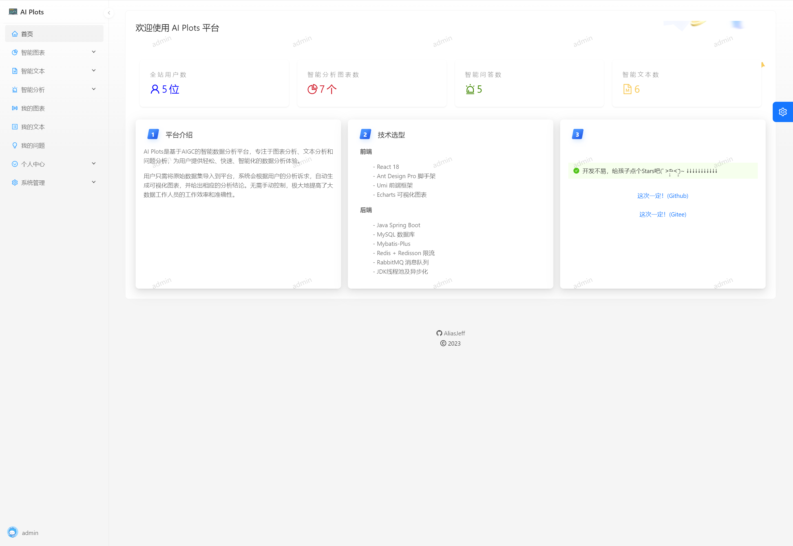
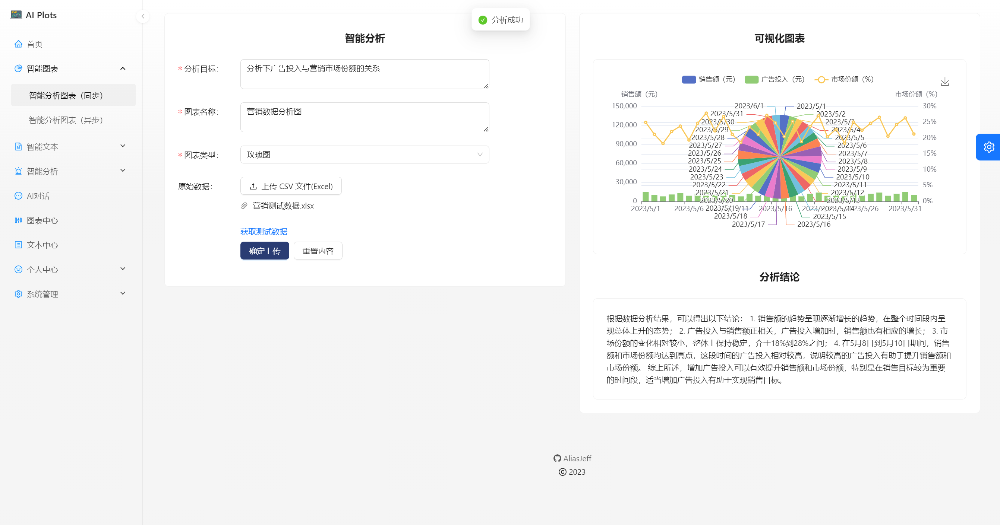
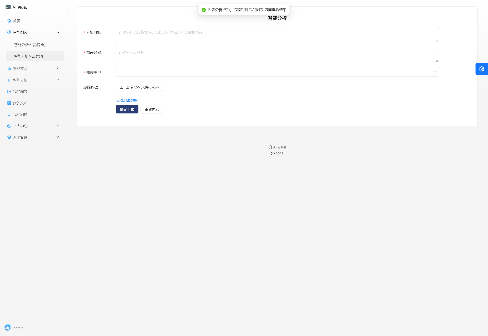
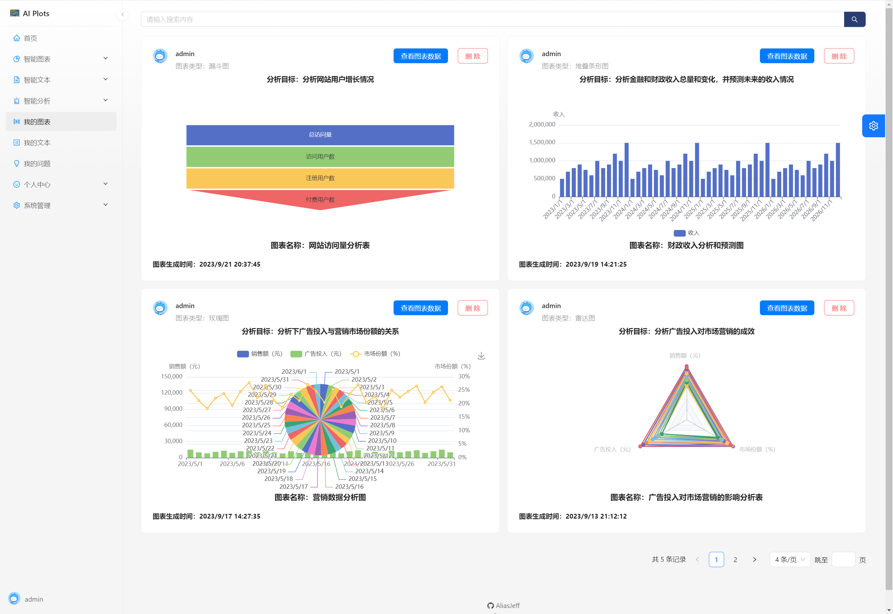
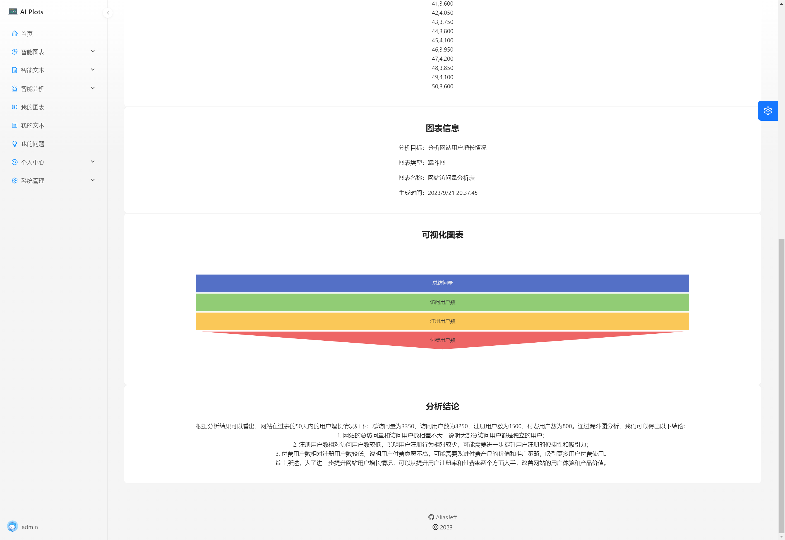
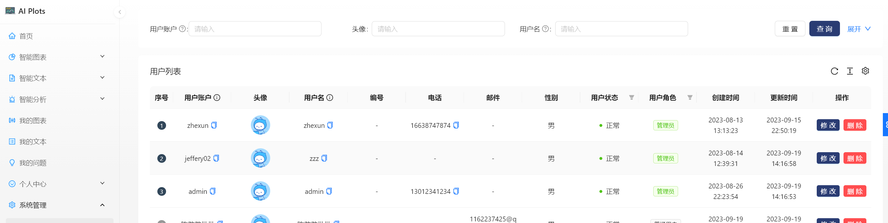
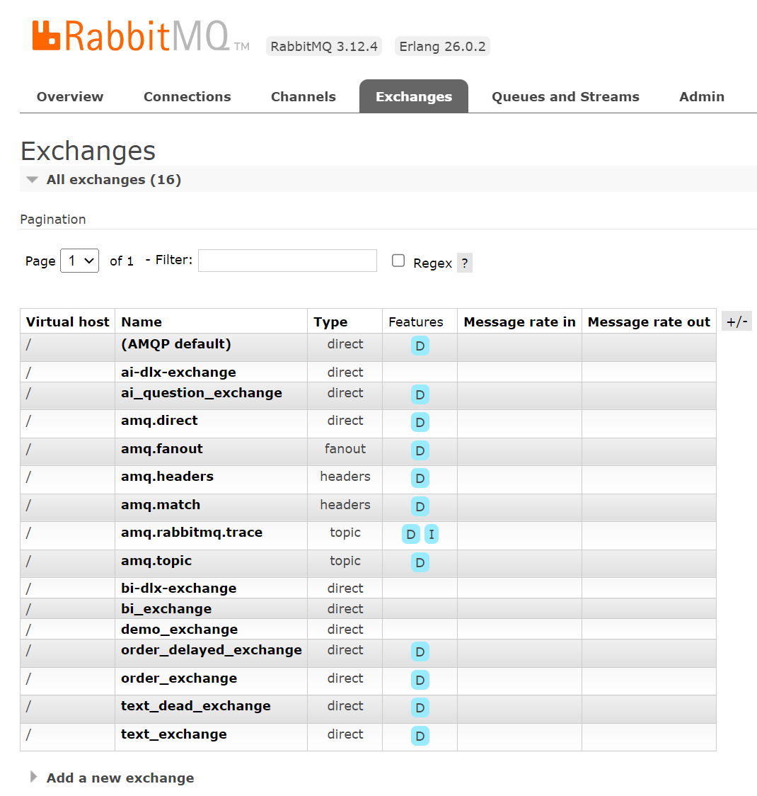

# AI Plots 项目笔记

## 线上地址

http://124.222.46.223/

## 源码

- Github

前端 https://gitee.com/AliasJeff/ai-plots-frontend

后端 https://gitee.com/AliasJeff/ai-plots-backend

- Gitee

前端 https://github.com/AliasJeff/ai-plots-frontend

后端 https://github.com/AliasJeff/ai-plots-backend

## 项目简介

AI Plots是基于AIGC的智能数据分析平台，专注于图表分析、文本分析和问题分析，为用户提供轻松、快速、智能化的数据分析体验。

用户只需将原始数据集导入到平台，系统会根据用户的分析诉求，自动生成可视化图表，并给出相应的分析结论。无需手动控制，极大地提高了大数据工作人员的工作效率和准确性。

## 主要业务架构



## 技术选型

### 前端

- React 18
- Ant Design Pro 脚手架
- Umi 前端框架
- Echarts 可视化图表

### 后端

- Java Spring Boot
- MySQL 数据库
- Mybatis-Plus
- Redis + Redisson 限流
- RabbitMQ 消息队列
- JDK线程池及异步化

## 主要工作

1. 基于 Redisson 的 RateLimiter 实现分布式限流，控制单用户访问频率
2. 使用自定义线程池和RabbitMQ消息队列实现AIGC并发执行和异步化，支持更多用户排队，减轻系统压力
3. 使用RabbitMQ消息队列接受任务并持久化保存，通过交换机转发给AI生成模块，实现应用解耦，提高系统可靠性

## 项目演示

1. 登录注册页

   用户输入账号密码登录，后台保存登录态。

   用户填写邮箱，后台发送邮箱验证码，验证密码和邮箱进行注册。

   

2. 主页

   

3. 智能图表分析

   提供了同步和异步的方法，异步处理能够将任务提交到消息队列，起到了解耦、限流等作用，避免在上传页面等待时间过长，提高用户体验

   

   

4. 我的图表

   展示用户分析的所有图表

   

5. 图表详情页

   查看原始数据、图表信息、分析结论

   

6. 个人中心

   展示用户个人信息，可以修改信息，每日签到领取调用次数

7. 用户管理页（仅管理员可见）

   管理员可对用户账户执行修改、删除

   


## 数据库设计

### user 用户表

|     列名     |   数据类型    | 可否为空 |                    默认值                     | 注释                        |
| :----------: | :-----------: | :------: | :-------------------------------------------: | --------------------------- |
|      id      |  bigint(20)   |    否    |                AUTO_INCREMENT                 | id                          |
| userAccount  | varchar(256)  |    否    |                                               | 账号                        |
| userPassword | varchar(512)  |    否    |                                               | 密码                        |
|   userName   | varchar(256)  |    是    |                     NULL                      | 用户昵称                    |
|  userAvatar  | varchar(1024) |    是    |                     NULL                      | 用户头像                    |
|   userRole   | varchar(256)  |    否    |                    'user'                     | user-普通用户 admin-管理员  |
|    gender    | varchar(256)  |    是    |                     NULL                      | 性别 男 女                  |
|    phone     | varchar(128)  |    是    |                     NULL                      | 电话                        |
|    email     | varchar(512)  |    是    |                     NULL                      | 邮箱                        |
|  userStatus  |    int(11)    |    否    |                       0                       | 状态 0 - 正常 1-注销 2-封号 |
|  createTime  |   datetime    |    否    |               CURRENT_TIMESTAMP               | 创建时间                    |
|  updateTime  |   datetime    |    否    | CURRENT_TIMESTAMP ON UPDATE CURRENT_TIMESTAMP | 更新时间                    |
|   isDelete   |  tinyint(4)   |    否    |                       0                       | 是否删除                    |

### chart 图表信息表

|    列名     |   数据类型   | 可否为空 |                    默认值                     | 注释                                                      |
| :---------: | :----------: | :------: | :-------------------------------------------: | --------------------------------------------------------- |
|     id      |  bigint(20)  |    否    |                AUTO_INCREMENT                 | id                                                        |
|    goal     |     text     |    是    |                     NULL                      | 分析目标                                                  |
|  chartName  | varchar(256) |    是    |                     NULL                      | 图表名称                                                  |
|  chartData  |     text     |    是    |                     NULL                      | 图表数据                                                  |
|  chartType  | varchar(256) |    是    |                     NULL                      | 图表类型                                                  |
|  genChart   |     text     |    是    |                     NULL                      | 生成的图表信息                                            |
|  genResult  |     text     |    是    |                     NULL                      | 生成的分析结论                                            |
| chartStatus | varchar(128) |    否    |                    'wait'                     | wait-等待,running-生成中,succeed-成功生成,failed-生成失败 |
| execMessage |     text     |    是    |                     NULL                      | 执行信息                                                  |
|   userId    |  bigint(20)  |    是    |                     NULL                      | 创建图标用户 id                                           |
| createTime  |   datetime   |    否    |               CURRENT_TIMESTAMP               | 创建时间                                                  |
| updateTime  |   datetime   |    否    | CURRENT_TIMESTAMP ON UPDATE CURRENT_TIMESTAMP | 更新时间                                                  |
|  isDelete   |  tinyint(4)  |    否    |                       0                       | 是否删除                                                  |

### ai_assistant AI问答信息表

|      列名      |   数据类型   | 可否为空 |                    默认值                     | 注释                                                      |
| :------------: | :----------: | :------: | :-------------------------------------------: | --------------------------------------------------------- |
|       id       |  bigint(20)  |    否    |                AUTO_INCREMENT                 | id                                                        |
|  questionName  | varchar(256) |    是    |                     NULL                      | 问题名称                                                  |
|  questionGoal  |     text     |    是    |                     NULL                      | 问题概述                                                  |
| questionResult |     text     |    是    |                     NULL                      | 问答结果                                                  |
|  questionType  | varchar(512) |    是    |                     NULL                      | 问题类型                                                  |
| questionStatus | varchar(128) |    否    |                    'wait'                     | wait-等待,running-生成中,succeed-成功生成,failed-生成失败 |
|  execMessage   |     text     |    是    |                     NULL                      | 执行信息                                                  |
|     userId     |  bigint(20)  |    是    |                     NULL                      | 创建用户 id                                               |
|   createTime   |   datetime   |    否    |               CURRENT_TIMESTAMP               | 创建时间                                                  |
|   updateTime   |   datetime   |    否    | CURRENT_TIMESTAMP ON UPDATE CURRENT_TIMESTAMP | 更新时间                                                  |
|    isDelete    |  tinyint(4)  |    否    |                       0                       | 是否删除                                                  |

### ai_frequency AI调用次数表

|      列名       |  数据类型  | 可否为空 |                    默认值                     | 注释         |
| :-------------: | :--------: | :------: | :-------------------------------------------: | ------------ |
|       id        | bigint(20) |    否    |                AUTO_INCREMENT                 | id           |
|     userId      | bigint(20) |    否    |                                               | 用户 id      |
| totalFrequency  | bigint(20) |    否    |                       0                       | 总调用次数   |
| remainFrequency |  int(11)   |    否    |                       5                       | 剩余调用次数 |
|   createTime    |  datetime  |    否    |               CURRENT_TIMESTAMP               | 创建时间     |
|   updateTime    |  datetime  |    否    | CURRENT_TIMESTAMP ON UPDATE CURRENT_TIMESTAMP | 更新时间     |
|    isDelete     | tinyint(4) |    否    |                       0                       | 是否删除     |

### text_record 文本记录表

|      列名      |   数据类型   | 可否为空 |                    默认值                     | 注释                        |
| :------------: | :----------: | :------: | :-------------------------------------------: | --------------------------- |
|       id       |  bigint(20)  |    否    |                AUTO_INCREMENT                 | id                          |
|   textTaskId   |  bigint(20)  |    是    |                     NULL                      | 文本任务id                  |
|  textContent   |     text     |    是    |                     NULL                      | 文本内容                    |
| genTextContent |     text     |    是    |                     NULL                      | 生成的文本内容              |
|     status     | varchar(128) |    否    |                    'wait'                     | wait,running,succeed,failed |
|  execMessage   |     text     |    是    |                     NULL                      | 执行信息                    |
|   createTime   |   datetime   |    否    |               CURRENT_TIMESTAMP               | 创建时间                    |
|   updateTime   |   datetime   |    否    | CURRENT_TIMESTAMP ON UPDATE CURRENT_TIMESTAMP | 更新时间                    |
|    isDelete    |  tinyint(4)  |    否    |                       0                       | 是否删除                    |

### text_task 文本任务表

|      列名      |   数据类型   | 可否为空 |                    默认值                     | 注释                        |
| :------------: | :----------: | :------: | :-------------------------------------------: | --------------------------- |
|       id       |  bigint(20)  |    否    |                AUTO_INCREMENT                 | 任务id                      |
|      name      | varchar(128) |    是    |                     NULL                      | 笔记名称                    |
|    textType    | varchar(128) |    是    |                     NULL                      | 文本类型                    |
| genTextContent |     text     |    是    |                     NULL                      | 生成的文本内容              |
|     userId     |  bigint(20)  |    是    |                     NULL                      | 创建用户Id                  |
|     status     | varchar(128) |    否    |                    'wait'                     | wait,running,succeed,failed |
|  execMessage   |     text     |    是    |                     NULL                      | 执行信息                    |
|   createTime   |   datetime   |    否    |               CURRENT_TIMESTAMP               | 创建时间                    |
|   updateTime   |   datetime   |    否    | CURRENT_TIMESTAMP ON UPDATE CURRENT_TIMESTAMP | 更新时间                    |
|    isDelete    |  tinyint(4)  |    否    |                       0                       | 是否删除                    |


## 项目设计

设计通用返回类

- 自定义错误码
- 自定义业务异常类

跨域处理

AOP

- 权限校验AOP，使用自定义注解拦截用户请求
- 请求相应日志AOP，收到请求-->拦截-->获取请求路径-->生成唯一请求id-->获取请求参数-->输出请求日志-->处理原请求

修改自定义全局请求响应拦截器

业务流程：

1. 用户输入
    - 分析目标
    - 原始数据（excel）
    - 精细控制，如图表类型、图标名称
2. 后端校验
    - 校验用户输入是否合法
    - 成本控制（次数统计和鉴权等）
3. 处理数据，调用 AI 接口， AI 模型提供图表信息（一段json配置）、结论文本
4. 前端展示


开发接口

上传excel文件

处理excel数据

AI 模型预设（职责、功能、回复格式要求）


用户Service

- 增删改查
- 用户注册、登录
- 保存、获取用户登录态

图表Service

- 增删改查
- 调用AI服务
- 线程池、消息队列
- 解析生成内容
- 错误处理


Redisson 限流（令牌桶）

限流粒度

1. 针对某个方法
2. 针对某个用户
3. 针对某个用户的某个方法


接口处理时长较长，需要异步化

异步化业务流程：

1. 点击提交后，任务保存到数据库
2. 用户要执行新任务时，把任务放到一个任务队列中，让程序（线程）从任务队列取出任务执行
    1. 任务提交到队列
        - 如果有空闲线程，直接执行任务
        - 如果线程繁忙，放到等待队列
    2. 任务队列满，提交失败
        - 拒绝任务
        - 检查数据库中的失败任务，空闲时重新执行
3. 线程从任务队列中取出任务依次执行，完成后更改任务状态
4. 用户可以查询任务执行状态，任务执行完成后消息提示

👆使用线程池

线程池作用：帮助管理线程，协调任务的执行过程

线程池管理：

1. 什么时候新增线程、减少空闲线程
2. 什么时候接收任务、减少任务

在项目中使用线程池

1. Spring中 ThreadPoolTaskExecutor 配合 @Async注解

2. Java 中使用 JUC 并发编程包的 ThreadPoolExecutor 灵活自定义线程池

   ```java
   public ThreadPoolExecutor(int corePoolSize,
                                 int maximumPoolSize,
                                 long keepAliveTime,
                                 TimeUnit unit,
                                 BlockingQueue<Runnable> workQueue,
                                 ThreadFactory threadFactory) {
           this(corePoolSize, maximumPoolSize, keepAliveTime, unit, workQueue,
                threadFactory, defaultHandler);
       }
   ```

   参数：corePoolSize 核心线程数、maximumPoolSize 最大线程数、keepAliveTime 空闲线程存活时间、unit 空闲线程存活时间的单位（秒）、workQueue 工作队列（用于存放一个队列的长度）、threadFactory 线程工程（控制线程生成、属性）

   ```java
   ThreadPoolExecutor threadPoolExecutor = new ThreadPoolExecutor(2, 4, 100, TimeUnit.SECONDS,
                   new ArrayBlockingQueue<>(10), threadFactory);
   ```


线程池的不足

1. 无法集中限制，只能单机限制
2. 任务存放在内存中，有丢失的风险
3. 不利于系统迭代维护，代码臃肿系统复杂


消息队列

优点：

1. 异步处理
2. 削峰填谷
3. 数据持久化（存储到硬盘）
4. 可扩展性：可以增加节点，继续保持稳定服务
5. 应用解耦：可以连接不同语言、框架开发的系统，灵活传输数据
6. 发布订阅：核心系统在消息队列发布消息，其它系统可以订阅读取消息

应用场景：

1. 耗时（异步）
2. 高并发（异步、削峰填谷）
3. 分布式系统（跨团队、跨业务、应用解耦）
4. 强稳定性的场景（持久化、可靠性）


Rabbit MQ




AI生成示例：

```
【【【【【
{
  "tooltip": {},
  "legend": {
    "data": ["销售额（元）", "广告投入（元）", "市场份额（%）"]
  },
  "toolbox": {
    "feature": {
      "saveAsImage": {}
    }
  },
  "series": [
    {
      "name": "销售额（元）",
      "type": "pie",
      "radius": "50%",
      "center": ["50%", "50%"],
      "data": [
        {"name": "2023/5/1", "value": 120000},
        {"name": "2023/5/2", "value": 98000},
        {"name": "2023/5/3", "value": 78000},
        {"name": "2023/5/4", "value": 92000},
        {"name": "2023/5/5", "value": 105000},
        {"name": "2023/5/6", "value": 88000},
        {"name": "2023/5/7", "value": 104000},
        {"name": "2023/5/8", "value": 123000},
        {"name": "2023/5/9", "value": 97000},
        {"name": "2023/5/10", "value": 116000},
        {"name": "2023/5/11", "value": 98000},
        {"name": "2023/5/12", "value": 82000},
        {"name": "2023/5/13", "value": 103000},
        {"name": "2023/5/14", "value": 92000},
        {"name": "2023/5/15", "value": 118000},
        {"name": "2023/5/16", "value": 107000},
        {"name": "2023/5/17", "value": 96000},
        {"name": "2023/5/18", "value": 110000},
        {"name": "2023/5/19", "value": 89000},
        {"name": "2023/5/20", "value": 104000},
        {"name": "2023/5/21", "value": 119000},
        {"name": "2023/5/22", "value": 93000},
        {"name": "2023/5/23", "value": 101000},
        {"name": "2023/5/24", "value": 85000},
        {"name": "2023/5/25", "value": 112000},
        {"name": "2023/5/26", "value": 99000},
        {"name": "2023/5/27", "value": 107000},
        {"name": "2023/5/28", "value": 116000},
        {"name": "2023/5/29", "value": 91000},
        {"name": "2023/5/30", "value": 106000},
        {"name": "2023/5/31", "value": 120000},
        {"name": "2023/6/1", "value": 98000}
      ]
    },
    {
      "name": "广告投入（元）",
      "type": "bar",
      "data": [15000, 10000, 8000, 11000, 13000, 9000, 12000, 15000, 10000, 14000, 10000, 8000, 12000, 9000, 14000, 12000, 10000, 13000, 8000, 12000, 14000, 9000, 11000, 8000, 13000, 10000, 12000, 14000, 9000, 12000, 15000, 10000]
    },
    {
      "name": "市场份额（%）",
      "type": "line",
      "yAxisIndex": 1,
      "data": [25, 21.2, 18.3, 22.1, 23.8, 19.4, 24.7, 27.9, 22.3, 26.8, 21.2, 18.6, 23.5, 21.2, 27.2, 24.8, 20.5, 25.3, 18.9, 23.7, 27.1, 20.4, 22.8, 18.4, 25.1, 22.5, 24.7, 26.6, 20.6, 24.3, 26.4, 21.3]
    }
  ],
  "xAxis": {
    "type": "category",
    "data": [
      "2023/5/1","2023/5/2","2023/5/3","2023/5/4","2023/5/5",
      "2023/5/6","2023/5/7","2023/5/8","2023/5/9","2023/5/10",
      "2023/5/11","2023/5/12","2023/5/13","2023/5/14","2023/5/15",
      "2023/5/16","2023/5/17","2023/5/18","2023/5/19","2023/5/20",
      "2023/5/21","2023/5/22","2023/5/23","2023/5/24","2023/5/25",
      "2023/5/26","2023/5/27","2023/5/28","2023/5/29","2023/5/30",
      "2023/5/31","2023/6/1"
    ]
  },
  "yAxis": [
    {
      "type": "value",
      "name": "销售额（元）",
      "min": 0,
      "max": 150000,
      "interval": 30000,
      "axisLabel": {
        "formatter": "{value}"
      }
    },
    {
      "type": "value",
      "name": "市场份额（%）",
      "min": 0,
      "max": 30,
      "interval": 5,
      "axisLabel": {
        "formatter": "{value}%"
      }
    }
  ]
}
【【【【【
根据数据分析结果，可以得出以下结论：

1. 销售额的趋势呈现逐渐增长的趋势，在整个时间段内呈现总体上升的态势；
2. 广告投入与销售额正相关，广告投入增加时，销售额也有相应的增长；
3. 市场份额的变化相对较小，整体上保持稳定，介于18%到28%之间；
4. 在5月8日到5月10日期间，销售额和市场份额均达到高点，这段时间的广告投入相对较高，说明较高的广告投入有助于提升销售额和市场份额。

综上所述，增加广告投入可以有效提升销售额和市场份额，特别是在销售目标较为重要的时间段，适当增加广告投入有助于实现销售目标。
```


## 优化思路

1. perf: 分表，提高数据库查询效率
2. feat: 邮箱注册登录✔
3. perf: 前端样式，复用代码抽取
4. perf: 后端代码优化，复用代码抽取
5. feat: 签到领取调用次数✔
6. style: 用户信息页美化
7. feat: 图表任务状态显示（执行中、已完成、失败），记录失败信息✔
8. feat: 智能文本功能✔
9. feat: 问题分析功能✔
10. feat: AI 对话功能❌
11. feat: 重新提交失败的图表(Guave Retrying)
12. perf: 优化AI生成内容解析✔
13. feat: 使用定时任务把没加入队列的任务重新加入队列（补偿）
14. feat: 异步图表生成后提示用户
15. feat: 我的图表页面增加刷新按钮
16. fix: nginx路由问题✔
17. style: 图表页使用瀑布流布局
18. perf: 用redis优化性能
19. perf: 优化rabbitmq配置
20. perf: 抽取ai调用sdk
21. feat: 获取测试数据改为文件下载
22. feat: 订单功能